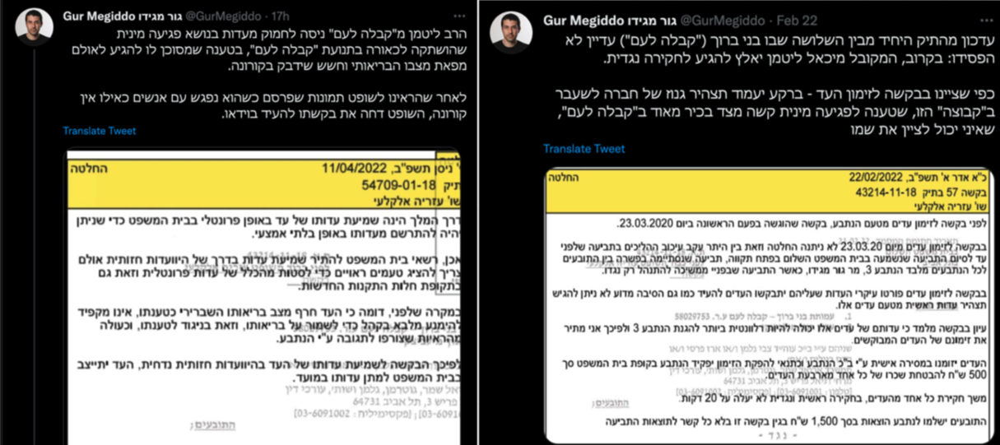
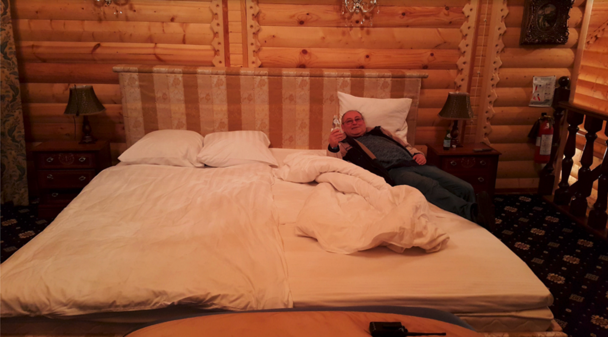
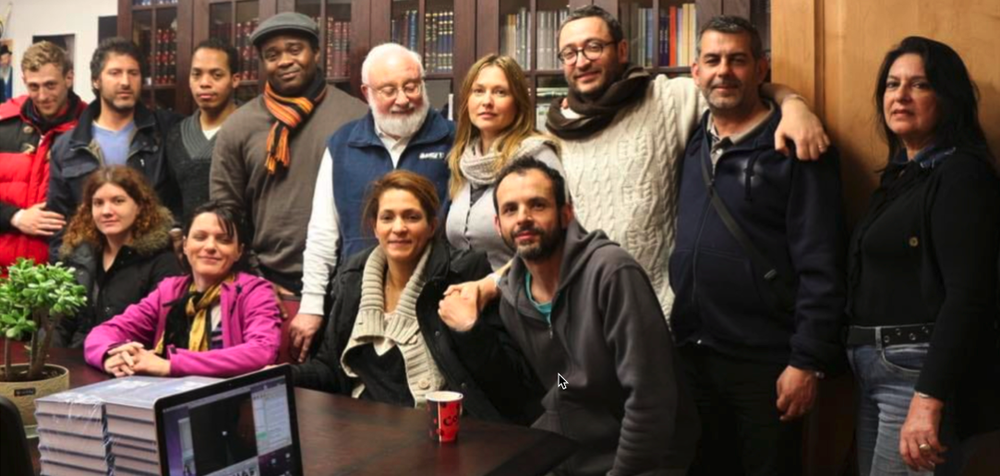

<h1> תלמדי בני ברוך יקרים שימו לב ! מיכאל לייטמן קיבל זימון לבית משפט בתאריך 27/4/22, בגין תביעת דיבה שמתנהלת בבית משפט בישראל. </h1>

כחלק מתיק התביעה הגישה תלמידה לשעבר תצהיר על אונס שעברה על ידו. כדי למנוע את פרסום הדבר השתמש באיומים קשים כנגדה, כולל
שימוש בעבריינים אשר סחטו אותה בצורה קשה, וכתוצאה מכך היא חזרה בה.
הרב לייטמן מ"קבלה לעם" ניסה לחמוק מעדות בנושא פגיעה מינית שהושתקה לכאורה בתנועת "קבלה לעם", בטענה שמסוכן לו להגיע לאולם
מפאת מצבו הבריאותי וחשש שידבק בקורונה.

לאחר שהראינו לשופט תמונות שפרסם כשהוא נפגש עם אנשים כאילו אין קורונה, השופט דחה את בקשתו להעיד בוידאו.

**[https://twitter.com/GurMegiddo/status/1513490961061535748](https://twitter.com/GurMegiddo/status/1513490961061535748)**

**[https://twitter.com/GurMegiddo/status/1496161496719663105](https://twitter.com/GurMegiddo/status/1496161496719663105)**

מזעזעת ומחרידה הרבה יותר היא תופעה שבה נשים הנשואות או בנות זוג של תלמידיו מספקות ללייטמן פורקן מיני !

מעשים אלו סופרו לאילנית יזרסקי, אף היא תלמידה בארגון ושימשה פסיכולוגית ויועצת חברתית בבני ברוך, במסגרת טיפול פסיכולוגי
של אילנית בקורבנות של התופעה המחרידה.

אילנית אף הופיעה בבית המשפט בעניין זה, אך בשל חיסיון רפואי השמות של הקרבנות נשארו חסויים, אבל אנחנו כאן כדי להוציא לאור
את האמת על המתרחש בבני ברוך.

פעמים רבות שמענו ש"הרב" לייטמן הוא אדם צנוע, וירא שמים, ואמנם תלמידיו מעולם לא מעיזים לשאול את הדבר הבא ?

לגור בבניין פרטי של 3 קומות עם בריכה, סאונה, ג'קוזי פרטי ומשרתות צעירות (סווטה רומנוב). האם זה נקרא חיים צנועים ?

האם תלמדיו יודעים שלכל הכנסים הרבים מסביב לעולם שאליהם הוא טס עם פמליה המתאימה לראש ממשלה שמשתפת פעולה עם מעשיו המיניים
הנבזיים, תמיד מחכים לו חדרים מפוארים, סוויטות ומשרתים שיטפלו בו בעיקר נשים כעוזרות אישיות שמטפלות בו לכל צרכיו...

  

**להלן כמה דגשים משמעותיים ומחרידים מהעדות מטה:**

**"כשהתקרבתי אל לייטמן והתחלנו לשוחח באופן אישי (להלן) היה אומר לי “אני רק מי שיביא אותך לבורא”.**
 
**עם זאת, לעיתים הוא אמר “בלעדיי לא תוכלו להרגיש את הבורא” או: “אני נמצא בתוכך כיוון שאני ברמה הגבוהה יותר רוחנית ואת**
**תוכלי להרגיש את הבורא רק באמצעותי”. הוא אמר שהוא הצינור שלי אל הבורא."**

**"זכור לי שבסמוך לכנס ז'אק דוייב (https://www.facebook.com/jacques.douieb) סיפר לי שלייטמן ביקש את לראות את תמונתי ואחרי שראה את התמונה אישר את תפקידי כעוזרתו. 
אשתו, נועם דוייב (https://www.facebook.com/douieb.noam) גם היא חזרה על דברים אלה בפני במהלך הקונגרס."**

**"ואז הוא אמר שאני יכולה לבוא לחדרו בערב, על מנת שאוכל לשאול אותו שאלות"**

**"הייתי בהלם. אמרתי לחברתי מהקבוצה מ’ שלייטמן הזמין אותי לחדרו. מ’ נדהמה ואמרה לי: “אם מה שאני חושבת נכון, אני מתכוונת**
**לעזוב את הקבוצה”. היא אמרה לי לא ללכת לחדר שלו."**

**"אמרתי לאריה מקרביץ׳ (https://www.facebook.com/profile.php?id=100000598045600) שאני נשואה. הוא לא ענה על כך. הוא לא אמר מפורשות שלייטמן רוצה לשכב איתי אבל הוא רמז לעובדה זו."**

**"אמרתי ללייטמן שאני לא מבינה איך הוא מסוגל לשכב עם אישה נשואה ואמרתי לו שאם הוא רוצה לשכב איתי אז אנחנו צריכים להיות**
**נשואים. לפי הקבלה, דרכה של אישה לרוחניות היא רק דרך בעלה. לייטמן פשוט צחק ואמר שאנחנו לא נתחתן."**

**"כשהייתי אצלו אמר לי מפורשות שהוא רוצה לשכב איתי. קיוויתי שאוכל לרצות אותו בלי לשכב איתו. הצעתי לתת לו עיסוי. הוא שאל**
**אותי: “את חושבת שיש לי בעיה עם נשים?”**

**"ערב אחד הגעתי לדירתו וקיימנו יחסי מין. זה היה מגעיל בשבילי. רק חיכיתי שזה ייגמר. זה היה נורא. הוא שכנע אותי לא להשתמש**
**בקונדום ואמר לי “אל תדאגי, את לא תיכנסי להריון”. ללייטמן יש מאפיינים פיזיים מסוימים שלא אפרט כאן כדי לא לפגוע בפרטיותו**
**מעל לדרוש אך אוכל לתאר אותם אם אשאל על כך."**

**"ביום שלמחרת הוא הזמין אותי שוב. הוא רצה לשכב איתי שוב אך לא היתה לו זקפה. הוא ביקש ממני לבצע בו מין אוראלי אבל לא הייתי**
**מסוגלת. הוא התרגז וגירש אותי מהדירה שלו."**

**[https://www.applebaum.org.il](https://www.applebaum.org.il)**

# עדות שמסרה תושבת חוץ שהיתה חסידה של בני ברוך לגבי פגיעה מינית שחוותה ממיכאל לייטמן בשנת 2014

<ol>
<li>
בשנת 2011 התגוררתי בצרפת. נתקלתי בשיעוריו של לייטמן באינטרנט והרגשתי שהוא נותן תשובות לכל שאלותיי. הרגשתי שכל חיי חיפשתי את הדרכים אל הבורא והוא היה הראשון שאמר בדיוק מה שרציתי לשמוע. התחלתי לשמוע את שיעוריו באופן אינטנסיבי.
</li>
<li>
בחודשים הראשונים הקשבתי לשיעורים רק באינטרנט. צפיתי בשיעורים ב- kab.tv בכל הזמן הפנוי והשתתפתי בקורסים מקוונים. כשלייטמן היה מרצה בנושאי קבלה, לא יכולתי שלא להקשיב לו. יחד עם זאת, לאף אחד מן המורים אחרים בבני ברוך לא הייתה השפעה דומה עליי.
</li>
<li>
לאחר כמה חודשים הרגשתי צורך לפגוש אנשים שגם הם בקבוצה, לאור מה שלייטמן תמיד היה אומר במהלך השיעורים שלו לפיו אדם יכול להרגיש את הבורא רק דרך אינטראקציה עם הקבוצה, עם “החברים”.
</li>
<li>
התחלתי להגיע לסעודות, לקונגרסי “מראה” ולמפגשים בחגים בקבוצת בני ברוך בצרפת.
</li>
<li>
הצטרפתי גם ל”קבוצה וירטואלית” במדינת מגוריי הקבוצה קיבלה את הנחיותיה מחבר קבוצת בני ברוך בפתח תקווה, ז'אק דוייב, ששימש כמתאם בין הקבוצה הפנימית לקבוצה שלנו. הקבוצה הכללית הייתה מתכנסת למפגש (וירטואלי) פעם בשבוע; כמו כן, עבדנו במסגרת של ועדות: ועדת קבלת-פנים, ועדת ספרים, וכו’, שגם אותן היינו מכנסים באופן וירטואלי למפגשים במהלך השבוע.
</li>
<li>
ז'אק דוייב היה מתרגם את שיעורי הבוקר של לייטמן באופן סימולטני… אני הייתי מקשיבה לשיעור הבוקר כל יום באתר האינטרנט של קבלה-מדיה, לא בזמן אמת (בלילה) אלא במהלך היום.
</li>
<li>
אני התנדבתי בכך שהקדשתי את כל זמני לתרגום הטקסטים של בני ברוך (ספרים, אתרים, הבלוג של לייטמן וכו’) מצרפת, על מנת לאפשר לדוברי צרפתית לקרוא אותם.
</li>
<li>
גם בעלי מתעניין בקבלה. למרות זאת, הוא מעולם לא העריך את בני ברוך או את לייטמן. הוא לא אהב את העובדה שביליתי כל כך הרבה זמן בהתנדבות עבורם. לא יכולתי לקבל את הביקורת שהעביר על בני ברוך.
</li>

# מעמדו של לייטמן בעיני באותה תקופה

<li>
לייטמן לימד אותנו שהבורא הוא בתוך הקבוצה. לעתים היה שואל את הקבוצה שאלה ואמר לנו לא להשתמש בשכל אלא להתחבר לקבוצה ולמצוא את התשובות במרכז של הקבוצה במהלך הסדנאות. הרגשתי שהקבוצה רק חוזרת על המילים של לייטמן ולא השתכנעתי בהתפתחות הרוחנית. באותן פעמים לא העזתי לבקר אותו אלא חשבתי לעצמי שלייטמן קרוב לבורא ושאין סיכוי שהוא טועה.
</li>
<li>
כשהתקרבתי אל לייטמן והתחלנו לשוחח באופן אישי (להלן) היה אומר לי “אני רק מי שיביא אותך לבורא”. עם זאת, לעתים הוא אמר “בלעדיי לא תוכלו להרגיש את הבורא” או: “אני נמצא בתוכך כיוון שאני ברמה הגבוהה יותר רוחנית ואת תוכלי להרגיש את הבורא רק באמצעותי”. הוא אמר שהוא הצינור שלי אל הבורא.
</li>
<li>
כשהקשבתי לקולו בשיעורים הקול שלו עשה אותי מאד רגועה ושלווה. הרגשתי תחושת עונג. לייטמן מאד בטוח בעצמו וכריזמטי וכשהוא דיבר הרגשתי שיש לו תשובות לכל השאלות שלי. לפעמים כאשר הוא התקשר אלי בסקייפ (להלן) הידיים שלי היו מעקצצות.
</li>

# הביקור בישראל וההכרות האישית עם לייטמן

<li>
ב-2014 הגעתי לישראל לקונגרס הזוהר. לפני כן לא הכרתי את לייטמן באופן אישי. הרגשתי שאני מעריצה אותו והוא היה המורה שלי אבל לא הכרתי אותו.
</li>
<li>
במהלך הכנס ז'אק דוייב הזמין את דוברי הצרפת של בני ברוך לכנס – כשמונה חברים מהקבוצה הוירטואלית וכן ישראלים דוברי צרפת  – לפגישה אישית עם לייטמן בדירתו שבמרכז בני ברוך בפתח תקווה. במהלך הפגישה התאספנו לתצלום קבוצתי ולייטמן נד אליי בראשו, כאילו הזמין אותי לעמוד קרוב אליו.
</li>
 

<li>
במהלך הקונגרס דובר על כך שכעבור כמה חודשים יתקיים באירופה קונגרס נוסף של בני ברוך באירופה.
</li>
<li>
כשחזרתי הביתה, בפגישת עבודה הראשונה אחרי הכנס ז'אק דוייב הודיע לנו שהקונגרס הבא יתקיים במדינת מגוריי! התפקיד שלנו היה לארגן את הכנס: למצוא מקום, לארגן הסעות, כיבוד וכו’.
</li>
<li>
הקבוצה הצרפת נחשבה לאחת הקבוצות הגרועות ביותר של בני ברוך – היה בה אחוז נשירה גבוה, לא היו הרבה חברים, לא הצלחנו לייצר פעילויות כפי שציפו מאתנו. היה עבורנו מאד קשה להכין קונגרס של בני ברוך. היינו מדברים על כך אבל ידענו שזה לא ריאלי.
</li>
<li>
אני הייתי מעורבת מאד בארגון הקונגרס.
</li>
<li>
לקראת הכנת הקונגרס הודיע ז'אק דוייב מייל לכל חברי הקבוצה שלפיו לי יש את הכבוד להיות העוזרת של רב בקונגרס. הייתי מאוד נרגשת ושמחה. ההזדמנות לפגוש ולשרת את רב הייתה כמו חלום שהתגשם.
</li>
<li>
זכור לי שבסמוך לכנס ז'אק דוייב (https://www.facebook.com/jacques.douieb) סיפר לי שלייטמן ביקש את לראות את תמונתי ואחרי שראה את התמונה אישר את תפקידי כעוזרתו. 
אשתו, נועם דוייב (https://www.facebook.com/douieb.noam) גם היא חזרה על דברים אלה בפני במהלך הקונגרס. 
</li>
<li>
כעוזרת האישית של לייטמן, אני קיבלתי את התפקיד להכין את השולחן של לייטמן במהלך הכנס – להביא לו מים, להכין לו תה, להביא לו כל דבר שיצטרך. כמו כך, ארגנתי את הקוטג’ עבורו (שמתי מים, יוגורט וכו’) ביחד עם נועם דוייב לפני הגעתו. לפני הקונגרס, עוזרת בשם ר. שהייתה עוזרת למרכז הקבוצה האירופאית של בני ברוך, שלחה לי את רשימת הדרישות של לייטמן – כל הדברים שצריך להכין עבורו (יוגורט, מים מסוימים וכו’). אני זוכרת שהעוזרת של לייטמן, ש., ביקשה מים מינרליים מסוג שלא קיים בצרפת  ואני הייתי מאד נבוכה מכך שלא עמדתי בדרישות של לייטמן (לייטמן עצמו אמר לי לאחר מכן שלא ייחס כל חשיבות לסוג המים המינרליים). אני זוכרת שדיברתי על כך עם חברי הקבוצה ואחת החברות שגרה קרוב לגבול הציעה שתיסע למדינה השכנה כדי לקנות מים מהסוג שביקש. לא העלינו על דעתנו לא לכבד את דרישותיו עד הקטנה שבהן.
</li>
<li>
כולנו היינו מוכנים לעשות כל דבר עבורו כיוון שהיינו אסירי תודה כלפיו כי חשבנו שהוא ילמד את האנושות כולה איך להתחבר לבורא.
</li>

# הכנס במדינת מגוריי

<li>
במסגרת ההכנות שנערכו לקראת הכנס, הזמנו מקומות לינה במעין קוטג’ים באתר הקונגרס. לייטמן שובץ ללון בקוטג’ יחד עם שומרי ראשו – מיכאל סנילביץ’ (https://www.facebook.com/michael.sanilevich) – בעלה של בתו ובחור בשם אריה מקרביץ׳. כשהם הגיעו לכנס הוא ביקש לשים את שומרי הראש בחדר נפרד, בצמוד לחדר שלו.
</li>
<li>
כשלייטמן הגיע לאתר הקונגרס הראיתי לו את החדר שלו (ואת היוגורט, המים וכו’) והוא התחיל לשאול אותי שאלות על עצמי. זה היה הרגע הכי מרגש בחיי. האדם שאני הכי מעריצה בעולם מדבר איתי במשך 15 דקות!
</li>
<li>
לאחר מכן הלכנו כולנו להרצאה שלו. תפקידיי במהלך ההרצאה היו להביא לו שתיה כשהיה צריך.
</li>
<li>
לאחר ההרצאה היתה ארוחה. אחרי הארוחה ניגשתי אליו ושאלתי אותו אם הוא צריך דבר מה נוסף. הוא שאל אותי אם יש לי שאלות בנושא קבלה. עניתי שכמובן שיש לי (מבחינתי הוא היה האדם שיכול לענות לכל שאלותי!). ואז הוא אמר שאני יכולה לבוא לחדרו בערב, על מנת שאוכל לשאול אותו שאלות.
</li>
<li>
הייתי בהלם. אמרתי לחברתי מהקבוצה מ’ שלייטמן הזמין אותי לחדרו. מ’ נדהמה ואמרה לי: “אם מה שאני חושבת נכון, אני מתכוונת לעזוב את הקבוצה”. היא אמרה לי לא ללכת לחדר שלו. קיבלתי את הצעתה כיוון שלא רציתי לדעת האם מה שאני חוששת ממנו נכון. לא יכולתי להרשות לעצמי להתאכזב ממנו. אמרתי לעצמי שאני בטח טועה לגבי כוונותיו; אבל, אפילו אם יש סיכון קטן שאני צודקת, עדיף לא לקחת את הסיכון. לא העזתי אפילו לומר לעצמי מפורשות ממה אני חוששת.
</li>
<li>
בבוקר למחרת כשהגעתי לאולם הקונגרס ראיתי אותו. הצעתי לו קפה והוא הגיב באגרסיביות: “אני לא צריך שום דבר ממך!”. 
 
התגובה שלו הייתה כל כך קשה שכמעט מעדתי.
</li>
<li>
נועם דוייב אשתו של ז'אק דוייב, ניגשה ושאלה אותי מה קרה כיוון שרב אמר לה שהוא לא רוצה שאני אכין לו קפה יותר, ושהוא רוצה שנ’ תכין לו קפה מעתה. אמרתי שאינני יודעת והתחלתי לבכות. ישבתי במהלך השיעור ובכיתי. לא יכולתי להסביר לנ’ למה לייטמן כעס עלי. אני חושבת שהבנתי במובן מסוים למה הוא כועס עלי אבל גם לא יכולתי להודות בפני עצמי באופן מלא.
</li>
<li>
הייתי מאד מבולבלת כיוון שהרגשתי כלפיו הערצה עצומה.
</li>
<li>
“שומר הראש” שלו, מקרביץ’, ניגש אלי ושאל אותי מה קרה. אמרתי שרב כועס עלי. הוא הזמין אותי ללכת לטיול והתחיל לדבר על כך שהוא נשוי אבל לעתים הוא רואה אישה שמוצאת חן בעיניו וזה בסדר. הוא רמז לי שזה בסדר עבור גבר נשוי לשכב עם נשים אחרות. הוא אמר גם שלייטמן נראה כעוס מאוד בבוקר כשמקרביץ’ ראה אותו ושהוא מעולם לא ראה אותו במצב כזה קודם לכן.
</li>
<li>
חשדתי שבדבריו הוא למעשה רמז לי שאם אשכב עם לייטמן, זה יהיה מעשה נורמלי לגמרי – אבל לא האמנתי שזה יכול להיות נכון בגלל הערצתי לרב. קיוויתי שטעיתי.
</li>
<li>
מקרביץ’ אמר לי שרב בחר אותי לשמש כעוזרת במהלך הקונגרס בגלל שראה את התמונה שלי. הוא אמר שלייטמן בחר אותי ולא רצה שנ’ תגיש לו קפה כיוון שלה יש שיער כהה ורב אוהב בלונדיניות. אמרתי למקרביץ’ שאני נשואה. הוא לא ענה על כך. הוא לא אמר מפורשות שלייטמן רוצה לשכב אתי אבל הוא רמז לעובדה זו. פחדתי לגשת ללייטמן ולכן ביקשתי ממקרביץ’ לומר ללייטמן שלא באתי בלילה לשוחח אתו כיוון שלא רציתי לסכן את מעמדו של לייטמן, כדי שיפסיק לכעוס עלי.
</li>
<li>
לקראת הערב ראיתי שלייטמן מחייך אלי. ניגשתי אליו והוא שאל אם באמת לא באתי כדי לא לפגוע במעמדו. הסברתי שלא באתי אליו כדי שלא לסכן את מעמדו כיוון שיש תלמידים רבים שלו במתחם שיכולים היו לחשוב מחשבות לא ראויות – המתחם קטן ויש בו הרבה חברי קבוצה, לא רציתי שאנשים יחשבו… הייתי מפוחדת מדי מכדי לנסות ולברר מולו האם חששותיי היו נכונים.
</li>
<li>
בערב חברי הקבוצה הביאו לו מתנות – ממתקים ודברים דומים. לייטמן תהה איפה לשים את המתנות ואני הצעתי לשים אותן באוטו שלי כי אולם הקונגרס היה רחוק מהחדרים. מקרביץ’ ניגש אלי ואמר לי להביא את הממתקים אל לייטמן לחדר בלילה.
</li>
<li>
בלילה ניגשתי עם המתנות לחדרו ודפקתי מאד בשקט, בתקווה שהוא לא ישמע. חשבתי לעצמי: ככה אוכל לומר למחרת שבאתי ולא פתחת לי. הוא אכן לא שמע ולא פתח, ולמחרת כבר עזב בחזרה לישראל.
</li>
<li>
ביום האחרון של הקונגרס שלאתי את לייטמן אם אוכל להגיע לישראל בקיץ למשך כמה שבועות על מנת להתנדב במרכז. הרגשתי צורך לתרום לבני ברוך ולתרום יותר לקבוצה שלי. הוא השיב בחיוב.
</li>
<li>
לאחר שחזר לארץ לייטמן התחיל להתנהג כאילו התאהב בי. הוא התחיל להתקשר אלי בסקייפ ולשלוח לי דוא”ל. הוא אמר לי שהוא אוהב להתקשר אליי בסקייפ ולהסתכל עלי במצלמת הוידיאו.
</li>
<li>
הרגשתי שמחה גדולה. לא אהבתי אותו כגבר: הוא זקן ומכוער. עם זאת, אהבתי אותו כמורה וכקשר שלי אל הבורא. הוא אמר לי שיש לי תכונות רוחניות מיוחדות, שאני מיוחדת ושהוא יעזור לי להתקדם מבחינה רוחנית.
</li>
<li>
לייטמן גרם לי להרגיש מיוחדת וחשובה. הוא אמר שאני אוכל לעזור מאד עם תרגום במרכז בני ברוך. אני התחלתי להרהר במעבר למרכז בני ברוך בפתח תקווה. החלום שלי היה לעבוד במרכז. זאת משום שבאותה עת האמנתי שעבודת ההפצה בבני ברוך היא הדרך הטובה ביותר לשרת את הבורא.
</li>
<li>
עדיין חשתי מלאת הוקרת תודה והערצה כלפיו כמורה רוחני. הוא היה האדם החשוב ביותר בחיי.
</li>
<li>
הגעתי לישראל ב- 2014. הגעתי לפתח תקווה משדה התעופה בסביבות אחת בלילה. אדם החבר בבני ברוך הגיע לאסוף אותי משדה התעופה. לייטמן התקשר אליי אחרי שנחתתי והזמין אותי לבוא ולהגיד שלום מיד. התארחתי אצל חברי הקבוצה קרוב למרכז בני ברוך. כשהגעתי, ביקשתי מהמארח שלי, ו’ ל’, שיראה לי איפה המרכז כיוון שאני רוצה להגיד שלום לרב. ו’ אמר לי שלייטמן ישן עכשיו ואי אפשר. אמרתי לו שרב מחכה לי. הוא לא האמין לי שיש לי כזה קשר אישי עם הרב, אך בסוף הוא השתכנע ולקח אותי למרכז.
</li>
<li>
כשהגענו לדירה של הרב (במרכז) לייטמן היה ער וציפה לי. לייטמן אמר לו שכעת הוא ואני צריכים לעבוד. ו’ נשאר במרכז לחכות לי למקרה שארצה לחזור הביתה.
</li>
<li>
חיבקתי את לייטמן והרגשתי שהוא רוצה משהו מעבר לחיבוק. הוא התחיל לשים עלי ידיים וניסה לנשק אותי. נגעלתי ודחיתי אותו. אמרתי לו שאני לא יכולה עכשיו. הוא לא התעקש ואמר: “טוב, את עייפה עכשיו. נתראה מחר”. הפגישה ערכה בערך 15 דקות. קראתי לו’ והלכנו הביתה.
</li>
<li>
למחרת הבאתי לו מתנות שהבאתי עבורו מהמדינה שלי. הוא ניסה לשכב איתי שוב וסירבתי. חוץ מהעובדה שלא הייתי מעוניינת, פשוט לא יכולתי להבין איך אדם בכזו רמה רוחנית מרשה לעצמו להפר את האיסור על מין מחוץ לנישואין ועל ניאוף (מאחר ואני אישה נשואה). אמרתי לעצמי שאם המשימה שלי בדרך להתעלות רוחנית היא להינשא ללייטמן אזי עליי לעשות זאת. חשבתי שאם הוא רוצה אותי בתור אישתו אז הוא יודע את הדרך הנכונה עבורי. למרות שלא רציתי אותו בתור גבר, הייתי מוכנה להקרבה הזו לטובתו של הבורא. אמרתי ללייטמן שאני לא מבינה איך הוא מסוגל לשכב עם אישה נשואה ואמרתי לו שאם הוא רוצה לשכב איתי אז אנחנו צריכים להיות נשואים. לפי הקבלה, דרכה של אישה לרוחניות היא רק דרך בעלה. לייטמן פשוט צחק ואמר שאנחנו לא נתחתן.
</li>
<li>
לייטמן אמר לי שהוא היה הערוץ שלי אל הבורא. הוא השתמש במונחים קבליים אחרים (השלב מעליך), שמשמעם היה שהדרך היחידה שלי להיות מוארת הייתה דרכו. כלומר, על מנת לקבל הארה (להתקדם מבחינה רוחנית) הייתה צריכה לשרת אותו ולבטל את עצמי בפניו.
</li>
<li>
לאחר שדחיתי אותו וכשהוא הבין שאני לא מוכנה לשכב איתו, הוא התחיל להפעיל עליי מניפולציות פסיכולוגיות. הוא התעלם ממני ואחר כך למחרת הוא הפגין המון חיבה. הוא הבין שאני מכורה אליו. לאחר כמה ימים הוא נסע לסוצ’י, רוסיה למשך כמה ימים לכנס בנושא החינוך האינטגרלי.
</li>
<li>
אני הייתי מאד מבולבלת. עדיין הערצתי אותו מאד אבל רציתי קשר רוחני ולא רומנטי אתו.
</li>
<li>
התחלתי לעבוד בתרגום הרצאותיו. האווירה במרכז הייתה מאוד שונה ממה שציפיתי על סמך סיפוריו של לייטמן. לפי התיאור של לייטמן, נהגתי לחשוב עליהם כעל המשפחה שלי. אבל כשהייתי במרכז לא הרגשתי אהבה בין החברים במרכז. הרגשתי שנאה. הופתעתי מאד. זה אמור היה להיות המקום הטוב ביותר בעולם: המקום שבו כולם אוהבים ודואגים אחד לשני. קשה לי להסביר אבל הרגשתי דחויה מצד חברי הקבוצה האחרים. ראיתי שמערכות היחסים בין חברי הקבוצה מבוססות על שנאה. הרגשתי בודדה מאד שם. המשכתי לעבוד בתרגומים כי רציתי להביא תועלת. כמו כן, הופתעתי מאוד מהאופן שבו לייטמן התייחס לחברי בני ברוך שעבדו במרכז. הוא לעיתים קרובות צרח עליהם, קילל והשתמש במילים מגונות וכו’. ריחמתי עליהם משום שהם בוודאי הרגישו מושפלים מאוד.
</li>
<li>
כשלייטמן חזר מרוסיה הוא המשיך לעשות לי מניפולציות פסיכולוגיות: הוא התעלם ממני לחלוטין לכמה ימים ואז פתאום נתן לי תשומת לב והזמין אותי למשרדו (בדירתו שבתוך המרכז, הצמוד לחדר השינה שלו) לדבר על התרגומים. כשהייתי אצלו אמר לי מפורשות שהוא רוצה לשכב אתי. קיוויתי שאוכל לרצות אותו בלי לשכב אתו. הצעתי לתת לו עיסוי. הוא שאל אותי: “את חושבת שיש לי בעיה עם נשים?”. ראיתי גם פעם אחת את אשתו. היא התגוררה במקום אחר, מחוץ למרכז. כששאלתי אותו עליה הוא אמר שהם לא גרים ביחד כבר עשרים שנה.
</li>
<li>
בסופו של דבר, כתוצאה מהמצב הפסיכולוגי בו הייתי שרויה, הסכמתי לשכב אתו. המחשבה על ההתעלמות שלו ממני הייתה כואבת מדי. הרגשתי שאם ימשיך לכעוס עלי לא אוכל להמשיך להתקיים. חשבתי לעצמי שאם הדבר היחיד שיספק את לייטמן הוא הגוף שלי אז עלי להקריב את הגוף שלי בשביל הנאתו. רציתי להעניק את עצמי (להשפיע) ולהתבטל במאת האחוזים. שקלתי לקיים איתו יחסי מין כמעשה של השפעה כלפי הבורא.
</li>
<li>
ערב אחד הגעתי לדירתו וקיימנו יחסי מין. זה היה מגעיל בשבילי. רק חיכיתי שזה ייגמר. זה היה נורא. הוא שכנע אותי לא להשתמש בקונדום ואמר לי “אל תדאגי, את לא תיכנסי להריון”. ללייטמן יש מאפיינים פיזיים מסוימים שלא אפרט כאן כדי לא לפגוע בפרטיותו מעל לדרוש אך אוכל לתאר אותם אם אשאל על כך. כך גם לגבי בעיית עור ממנה סובל. אני בוחרת שלא לחשוף כאן פרטים על מנת שלא לפגוע בפרטיותו מעל לדרוש אולם אוכל למסור על כך פרטים אם אשאל. נגעלתי ממנו ומהגוף שלו מאד.
</li>
<li>
הסכמתי לשכב עם לייטמן רק בגלל מעמדו הרוחני ובגלל שראיתי בו את המנהיג הרוחני שלי. לעולם אף פעם לא הייתי מסכימה לעשות זאת אלמלא סיבות אלו. עשיתי זאת משום שהערצתי אותו כל כך ולא יכולתי להשלים עם הרעיון שהוא יכעס עליי. במחשבה לאחור, אני מרגישה שהוא כפה עליי לעשות כן תוך שימוש במניפולציות פסיכולוגיות, ושהוא ניצל את האמון שהיה לי בו.
</li>
<li>
ביום שלמחרת הוא הזמין אותי שוב. הוא רצה לשכב אתי שוב אך לא היתה לו זקפה. הוא ביקש ממני לבצע בו מין אוראלי אבל לא הייתי מסוגלת. הוא התרגז וגירש אותי מהדירה שלו.
</li>
<li>
הלכתי לחדר שלי והרגשתי חולה מאד. החום שלי עלה, הראש שלי כאב מאד. בד”כ אני סובלת מלחץ דם נמוך. אשתו של ו’ בדקה את לחץ הדם שלי והוא היה מאד גבוה. שכבתי במיטה למשך יומיים.
</li>
<li>
לייטמן לא יצר אתי קשר יותר.
</li>
<li>
הייתי אמורה להישאר במרכז שבועיים אבל, לאור מה שזה עתה חוויתי, לא יכולתי להישאר שם יותר. התקשרתי אל בעלי וסיפרתי לו על מה שארע. ביקשתי מבעלי להקדים את טיסתי חזרה הביתה וטסתי כעבור עשרה ימים במקום שבועיים.
</li>

# לאחר החזרה למדינה שלי

<li>
לאחר שחזרתי הביתה. לא הבנתי מה קורה לי. הרגשתי שבורה לחלוטין. כאילו איבדתי כל מה שהיה לי, כאילו החיים שלי התפוצצו. אני זוכרת שהסתכלתי במראה והתפלאתי איך אני נראית שלמה כשאני כל כך שבורה מבפנים. היו לי מחשבות אובדניות ובמקביל הייתה לי הרגשה מוזרה שאני אפילו לא יכולה להתאבד כי כבר הייתי מתה. אני זוכרת שבימים הראשונים פחדתי מאד להישאר לבד. ביקשתי מבעלי להישאר אתי בבית. הרגשתי בתוך ואקום – כאילו אני לא יודעת איפה הרצפה. קשה לי מאד להסביר את התחושה בדיעבד.
</li>
<li>
אמרתי לעצמי שככל הנראה בהתנהלות שלי נפל פגם ושאני אשמה במשהו. הקבלה היתה הכל בשבילי ולא יכולתי לדמיין את החיים בלעדיה. הרגשתי שלא אוכל לנשום בלי הקבלה. מצד שני, לא יכולתי להקשיב ללייטמן יותר.
</li>
<li>
לא סיפרתי לאף אחד בקבוצה שלי למה חזרתי מוקדם. אמרתי שהמשפחה שלי היתה מודאגת כיוון שהיתה מתיחות עם עזה באותה תקופה. שלחתי מייל לחברי הקבוצה שעלי לקחת מרחק מהקבוצה לזמן מה ותודה על ההבנה.
</li>
<li>
מבין חברי הקבוצה, רק למ’ (חברה מהקבוצה) סיפרתי מה באמת קרה. היא נדהמה מהסיפור. שתינו לא ידענו מה לעשות כיוון שלא הצלחנו להפריד בין לייטמן ובין הקבלה. הרגשנו את האור מהקבלה אבל לייטמן היה מפלצת.
</li>
<li>
עדיין רציתי ללמוד קבלה אבל לא ידעתי איך. לא היה לי עם מי לדבר על כך. כעשרה ימים אחרי שחזרתי הביתה כתבתי לאדם שהכרתי מבני ברוך, פ. שהערכתי מאוד. כתבתי לו שאני רוצה ללמוד קבלה אבל שהכרתי מקרוב את לייטמן ושהוא מפלצת. הוא שאל אותי אם זה קשור לסקס, ואמרתי שכן, משהו כזה. שאלתי אותו איך להמשיך. הוא המליץ לי להתעלם ממה שקרה עם לייטמן ולהמשיך ללמוד, ושאני “אעבור את המחסום” אם אמשיך בלימודים למרות מה שקרה אתו.
</li>
<li>
במהלך החודש הראשון לאחר שחזרתי ניסיתי להקשיב שוב לשיעוריו של לייטמן וגיליתי שאני לא מסוגלת. אמרתי לעצמי שלא יכול להיות שהאור יבוא דרך אדם כל כך רע. לא הבנתי למה אני לא מאמינה יותר בדברים שלו. הרגשתי פקפוק בדבריו. לפני מה שקרה האמנתי בלייטמן יותר משהאמנתי בעצמי.
</li>
<li>
במהלך השבועות הראשונים לאחר שחזרתי אני ולייטמן לא התכתבנו. אחרי בערך כחודש הקשבתי להרצאה שלו וכתבתי לו שנראה שחזרתי לבני ברוך. קיוויתי שהוא ייתן לי תשובות: שאלתי אותו מה קרה ולמה זה קרה כך. הוא ענה לי שהוא מאד שמח ושהוא הצטער על כל מה שקרה, שהכל קרה באשמתו ושהוא מקווה שנשכח כל מה שקרה ונעבור הלאה. הוא אמר שבעתיד אדע למה הכל קרה באופן שבו הוא קרה.
</li>
<li>
ניסיתי להיות מעורבת שוב בפעילת של בני ברוך. הקשבתי לשיעורים מקוונים וסייעתי בהכנת הקונגרס האירופאי הבא באמצעות תרגום אתר הקונגרס והצטרפות לצוות הרישום, אבל הרגשתי ספקנית ביחס ללייטמן ויכולתי כעת לראות שהוא שגה בפרשנות שלו ביחס לכמה ממקורות הקבלה. נתבקשתי לתרגם את התוכנית של לייטמן שהתפרסמה ביוטיוב בנושא “סודות הספר הנצחי”… התחלתי להבחין בכך שכמה מהפרשנויות של לייטמן לתורה שונות מהפרשנויות של הרב”ש. לא האמנתי יותר ללייטמן בצורה עיוורת.
</li>

# הקשר עם מ’ וההתנתקות מבני ברוך

<li>
זמן מה לאחר מכן הכרתי באופן וירטואלי את מ’. מ’ ואני היינו חברים בפייסבוק מזה זמן רב, כיוון שאישרתי אוטומטית בקשות מחברים מבני ברוך. היו לי כאלפיים חברים שכמובן את רובם לא הכרתי.
</li>
<li>
יום אחד נתקלתי בפייסבוק בפוסט ביקורתי שמ’ כתב על בני ברוך. זאת הייתה הפעם הראשונה שראיתי פוסט ביקורתי בנוגע לבני ברוך מצד בן אדם אמיתי שאתו הייתי מסוגלת ליצור קשר, ושלא היה נראה משוגע או בלתי-אמין, אלא אחד שנראה כאילו ידע על מה הוא מדבר. יצרתי אתו קשר ושאלתי אותו אם אפשר ללמוד קבלה בלי לייטמן.
</li>
<li>
זאת הייתה הפעם הראשונה שראיתי פוסט ביקורתי לגבי בני ברוך. מעולם לא ראיתי דעות ביקורתיות ביחס לבני ברוך לפני כן ממקור אינטרנטי אמין. מסיבה זו תמיד הרגשתי שאם אני מרגישה שמשהו בבני ברוך אינו נכון, זאת הייתה בעיה שלי ושבעיה זו מקורה בתוכי. לייטמן תמיד היה אומר שאם אנחנו מזהים משהו שאינו נכון בתוך הקבוצה, אז האשמה לכך היא בתוכנו.
</li>
<li>
מ’ ואני התחלנו להתכתב. לאחר זמן מה סיפרתי לו מה קרה לי. הוא היה הראשון שהבין אותי ומאד עזר לי ותמך בי. גם מ’ לומד קבלה בלי לייטמן והוא הצליח להראות לי איך אפשר ללמוד קבלה בלי הפרשנות של לייטמן.
</li>
<li>
אחרי שעזבתי הבנתי שקבוצת בני ברוך הזיקה לי מאד. הבנתי שכלל לא עבדתי עבור הבורא אלא עבור ארגון אינטרסנטי שמנסה לשלוט באנשים ובמיוחד עבור לייטמן שניצל את שאיפותיי הרוחניות על מנת להגשים את תאוותיו הגשמיות. הרגשתי שהם ניצלו לרעה את האמון שלי בהם.
</li>
<li>
אחרי שניתקתי קשר עם בני ברוך כמעט ולא כתבתי עליהם ברשת. אין לי רגשות נקם או שנאה כלפי לייטמן. בדיעבד, אני שמחה על מה שקרה לי כיוון שאם לייטמן לא היה פוגע בי לא הייתי עוזבת את הקבוצה לעולם.
</li>
</ol>

# **האישה שמסרה את העדות הזו היתה מוכנה להעיד עליה בבית משפט, אבל למרות שהיה חיסיון על פרטיה, הפרטים הודלפו לגורמים שרצו למנוע ממנה להעיד ואיימו על חייה ועל חיי משפחתה, ובסופו של דבר האישה הודיעה שלא תעיד נגד מיכאל לייטמן.**

