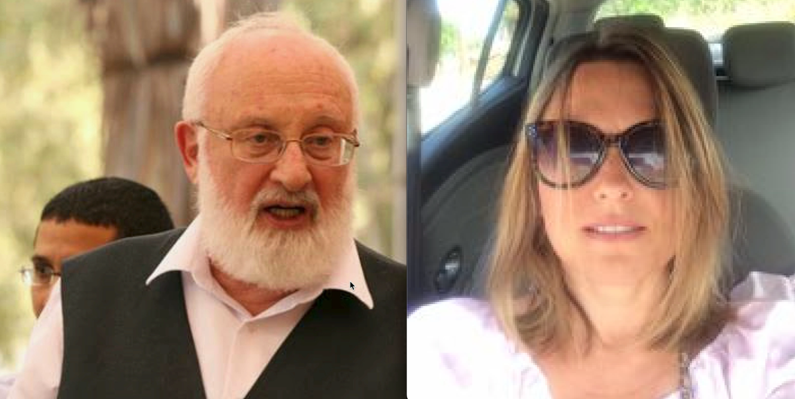
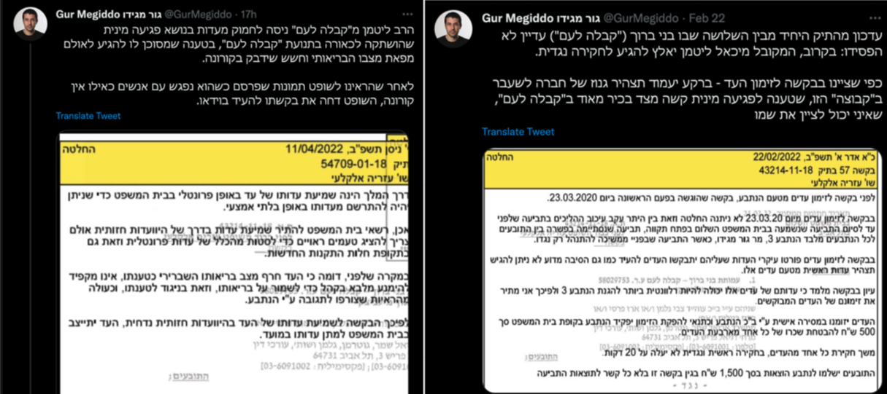
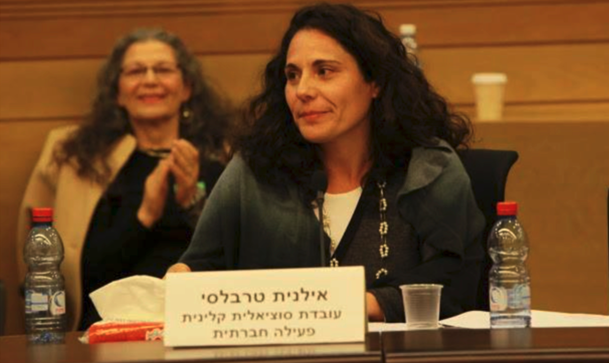
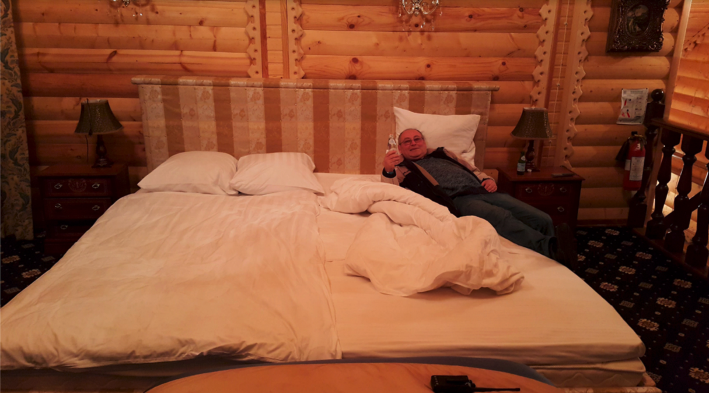
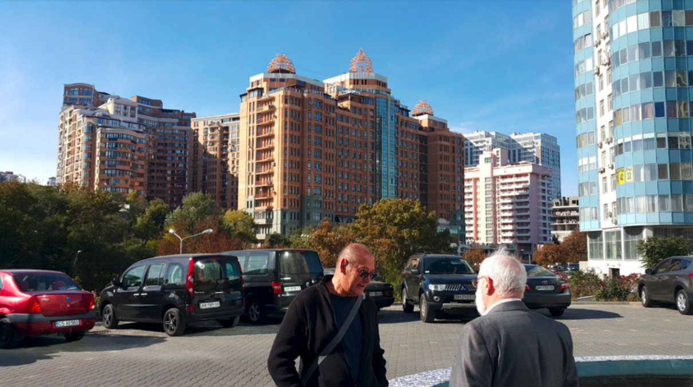
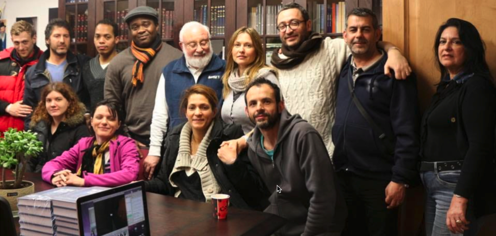

<h1> Уважаемые студенты Бней Барух, обратите внимание! 27.04.22 Михаэль Лайтман получил повестку в суд по иску, в котором его обвиняют в изнасиловании бывшей студентки на фото.</h1>

<a href="https://www.facebook.com/sharer/sharer.php?u=https://github.com/r/apistlaitman/shame-laitman/wiki/Russian" target="_blank">
  Share on Facebook
</a>

<a href="https://www.linkedin.com/sharing/share-offsite/?url=https://github.com/rapistlaitman/shame-laitman/wiki/Russian" target="_blank">
Share on LinkedIn
</a>

В рамках обвинения бывшая студентка подала показания под присягой об изнасиловании, которое он совершил Михаэль Лайтман.
Чтобы это не было опубликовано, он применял против нее резкие угрозы, в том числе использовал преступников, которые жестоко ей угрожали расправой с её матерью и семьи, и в результате она остановила иск и забрала заявление.
Рав Михаэль Лайтман из «Каббала для народа» пытался уклониться от показаний относительно сексуального насилия, которое замалчивалось в самом движении «Каббала для народа», утверждая, что ему опасно входить в зал суда из-за состояния его здоровья что он заразится короной вирусом.

После того как мы показали судье фотографии, которые он разместил в интернете во время встреч и конгрессов, как будто короны не существует, судья отклонил его просьбу дать показания на видео.

**[https://twitter.com/GurMegiddo/status/1513490961061535748](https://twitter.com/GurMegiddo/status/1513490961061535748)**

**[https://twitter.com/GurMegiddo/status/1496161496719663105](https://twitter.com/GurMegiddo/status/1496161496719663105)**

Весьма возмутительно и ужасающе явление, в котором замужние женщины или супруги его учеников дают Лайтману сексуальную услуги в надежде что через это действие им перепадет частичка духовного мира ! (как он обучает, духовное передается напрямую...)

Об этих случаях рассказала Иланит Езерски, которая также была студенткой организации и работала психологом и социальным работником в Бней Барухе, в рамках психологического лечения жертв ужасного явления.

Иланит даже предстала перед судом по этому делу и дала показания, но из-за медицинской этики имена пострадавших остались конфиденциальными, а мы здесь для того, чтобы обнародовать правду о том, что происходит в Бней Барухе.

Много раз мы слышали, что «рав» Лайтман — скромный человек, и его ученики никогда не осмеливаются спросить следующее?

Жизнь в 3-х этажном частном доме с бассейном, сауной, личным джакузи и молодыми служанками (Света Романова) - Это называется скромная жизнь?

Знают ли его ученики, что на всех многочисленных конгрессах по всему миру, к которым он летит со свитой, подходящей для премьер-министра, всегда найдутся роскошные комнаты, апартаменты и слуги, ожидающие заботы о нем?...

Арье Макаревич арендует для Лайтмана шикарную гостиницу с кроватью 3 на 3 метра для удовлетворения минимальных и скромных желаний…

<a href="https://www.facebook.com/sharer/sharer.php?u=https://github.com/r/apistlaitman/shame-laitman/wiki/Russian" target="_blank">
  Share on Facebook
</a>

<a href="https://www.linkedin.com/sharing/share-offsite/?url=https://github.com/rapistlaitman/shame-laitman/wiki/Russian" target="_blank">
Share on LinkedIn
</a>

Вот некоторые важные и ужасающие моменты из приведенных ниже свидетельства:

«Когда я подошла к Лайтману, и мы начали общаться лично (ниже), он сказал мне: «Я как раз тот, кто приведет тебя к Творцу».
Однако он иногда говорил: «без меня вы не сможете почувствовать Творца» или: «Я внутри вас, потому что я нахожусь на более высоком духовном уровне, и вы можете чувствовать Творца только через меня».
Он сказал, что он мой проводник к Творцу».

«Я помню ближе к дате конгресса Жак Дуев (https://www.facebook.com/jacques.douieb) сказал мне, что Лайтман попросил показать мою фотографию и, увидев фотографию подтвердил мою роль в качестве его помощника. 
 
Его жена Ноам Дуев (https://www.facebook.com/douieb.noam) она тоже повторяла мне эти вещи во время Конгресса».

«Потом он сказал, что я могу прийти к нему в комнату вечером, чтобы задать ему вопросы».

«Я была потрясена. Я рассказала подруге по группе что Лайтман пригласил меня к себе в номер. Подруга была в шоке и сказала мне: «Если это то что я думаю то я намерена покинуть эту группу». Она посоветовала мне не ходить в его комнату».

«Я сказала Макаревичу (https://www.facebook.com/profile.php?id=100000598045600) что я замужем.
Он не ответил мне и не сказал прямо, что Лайтман хочет со мной переспать, но намекнул на это».

«Я сказала Лайтману, что не понимаю, как он может спать с замужней женщиной, и сказала ему, что если он хочет спать со мной, то мы должны пожениться. Согласно каббале, путь женщины к духовности лежит только через мужа. Лайтман только рассмеялся и сказал, что мы не поженимся».

«Когда я была с ним, он прямо сказал мне, что хочет переспать со мной. Я надеялась, что смогу доставить ему удовольствие, не переспав с ним. Я предложила сделать ему массаж. Он спросил меня: «Как ты думаешь, если ли у него проблемы с женщинами?»

«Однажды вечером я пришла к нему на квартиру, и мы занялись сексом. Это было отвратительно для меня. Я просто ждала, когда это закончится. Это было ужасно. Он убедил меня не пользоваться презервативом и сказал: «Не волнуйся, ты не забеременеешь».
 
У Лайтмана есть определенные физические характеристики, которые я не буду здесь подробно описывать, чтобы не нарушать его частную жизнь без разрешения, но я могу описать их, если спросят меня об этом».

«На следующий день он снова пригласил меня. Он снова хотел переспать со мной, но у него не было эрекции. Он попросил меня заняться с ним оральным сексом, но я не смогла. Он разозлился и выгнал меня из своей квартиры».

**[https://www.applebaum.org.il](https://www.applebaum.org.il)**

<a href="https://www.facebook.com/sharer/sharer.php?u=https://github.com/r/apistlaitman/shame-laitman/wiki/Russian" target="_blank">
  Share on Facebook
</a>

<a href="https://www.linkedin.com/sharing/share-offsite/?url=https://github.com/rapistlaitman/shame-laitman/wiki/Russian" target="_blank">
Share on LinkedIn
</a>

# Свидетельство бывшей студентки Бней Барух, о сексуальном насилии которому она подверглась со стороны Михаэля Лайтмана в 2014 году.

<ol>
<li>
В 2011 году я жила во Франции. Я наткнулась на курсы Лайтмана в Интернете и почувствовала, что он дает ответы на все мои вопросы. Мне казалось, что я всю жизнь искала пути к Творцу, и он первый сказал именно то, что я хотела услышать. Я стала интенсивно слушать его уроки.
</li>
<li>
Первые несколько месяцев я слушала занятия только онлайн. Все свободное время смотрела занятия на kab.tv и посещала онлайн-курсы. Когда Лайтман был лектором по каббале, я не могла не слушать его. В то же время ни один из других учителей Бней Барух не оказал на меня подобного влияния.
</li>
<li>
Через несколько месяцев у меня возникла потребность познакомиться с людьми, которые также учатся в группе, и в свете того, что Лайтман всегда говорил на своих уроках, что человек может почувствовать Творца только через взаимодействие с группой, с «своими».
</li>
<li>
Я начала посещать трапезы в нашем центре, «зеркальные» конгрессы и праздничные встречи в группе «Бней Барух» во Франции.
</li>
<li>
Я также присоединилась к «виртуальной группе» в моей стране, группа получила инструкции от члена группы Бней Барух в Петах-Тикве, Жак Дуев и его жена Ноам Дуев, которые были координаторами между внутренней группой и нашей группой. Общая группа собиралась на (виртуальное) собрание раз в неделю. Мы также работали в отделе приёма новых учеников, и в книжном комитете, которые мы также собирали виртуально для встреч в течение недели.
</li>
<li>
Жак Дуев одновременно переводил симультанно утренние уроки Лайтмана… Я каждый день слушала утренний урок на сайте «Каббала-Медиа», не в реальном времени (ночью), а днем.
</li>
<li>
Я решила посвятить все свое время переводам текстов Бней Барух (книги, веб-сайты, блог Лайтмана и т.д.) на Французский, чтобы их могли читать лекторы.
</li>
<li>
Мой муж тоже интересовался каббалой. Несмотря на это, он никогда не уважал ни Бней Барух, ни Лайтмана. Ему не нравилось, что я трачу так много времени на волонтерство. Я не могла принять его критику, которую он говорил о Бней Барух.
</li>

# Статус Лайтмана в моих глазах в то время

<li>
Лайтман учил нас, что Творец находится внутри группы. Иногда он задавал группе вопрос и говорил нам не использовать разум, а соединиться с группой и найти то, что нужно. Он повторял что нужно вернуться в центр группы во время семинаров. Я чувствовала, что группа просто повторяла слова Лайтмана, и я не была уверена в этом духовном развитии. Но в то время я не осмеливалась его критиковать, а думала про себя, что Лайтман близок к Творцу и не может быть, чтобы он ошибается.
</li>
<li>
Когда я подошла к Лайтману и мы начали общаться лично (ниже), он говорил мне: «Я единственный, кто приведет тебя к Творцу». Однако он иногда говорил: «без меня вы не сможете почувствовать Творца» или: «Я внутри вас, потому что я нахожусь на более высоком духовном уровне, и вы можете чувствовать Творца только через меня». Он сказал, что он мой проводник к Творцу.
</li>
<li>
Когда я слушала его голос на уроках, его голос делал меня очень спокойным и умиротворенным. Я испытала чувство удовольствия. Лайтман очень уверен в себе и харизматичен, и когда он говорил, я чувствовала что у него есть ответы на все мои вопросы. Иногда, когда он звонил мне по скайпу (ниже), у меня покалывали руки.
</li>

# Визит в Израиль и личное знакомство с Лайтманом

<li>
В 2014 году я приехала в Израиль на конгресс Зоар. До этого я не знала Лайтмана лично. 
</li>
<li>
Я чувствовала, что обожаю его, и он был моим учителем, но я не знала его.
</li>
<li>
Во время конгресса Жак Дуев пригласил на сцену студентов Бней Барух во Франции их было около восьми членов виртуальной группы, а также на личную встречу с Лайтманом в его квартире в центре Бней Барух в Петах-Тикве. Во время встречи мы собрались для группового фото, и Лайтман покачал головой, как бы приглашая меня встать рядом с ним.
</li>

<li>
Во время конгресса ходили разговоры о том, что через несколько месяцев в Европе состоится еще один конгресс Бней Барух.
</li>
<li>
Когда я вернулась домой, на первой рабочей встрече после конгресса он сообщил нам, что следующий Конгресс будет проходить в стране моего проживания! Нашей задачей было организовать конференцию: найти место, организовать транспорт, питание и т.д.
</li>
<li>
Группа Франции считалась одной из худших групп Бней Барух — в ней был высокий процент отсева, участников было немного, мы не могли проводить мероприятия, как от нас ожидали. Нам было очень трудно подготовить съезд Бней Барух. Мы говорили об этом, но знали, что это нереально.
</li>
<li>
Я принимала активное участие в организации Конгресса.
</li>
<li>
При подготовке к конгрессу Жак Дуев сообщил всем членам группы, что я имею честь быть помощником Лайтмана на конгрессе. Я была очень взволнована и счастлива. Возможность встретиться и послужить раву была похожа на сбывшуюся мечту.
</li>
<li>
Я помню, что ближе к дате конгресса Жак Дуев рассказал мне что Лайтман попросил его посмотреть мою фотографию, увидев мою фотографию Лайтман подтвердил мою роль своего помощника.
Ноам Дуев жена Жака тоже повторяла мне это во время конгресса.
</li>
<li>
Мне, как личному помощнику Лайтмана, было поручено подготовить стол для Лайтмана во время конференции - принести ему воды, приготовить чай, принести ему все необходимое. Также я организовала ему коттедж в котором он проживал (принесла воду, йогурт и т.д.) вместе с Н. До его прибытия. Перед Конгрессом помощник по имени Р. Был ассистентом центра европейской группы Бней Баруха, прислал мне список требований Лайтмана - все, что нужно для него приготовить (йогурт, немного воды и т.д.). Помню, помощник Лайтмана С. просил минеральную воду и такого типа, которого не было во Франции, и я очень смущалась что не соответствую требованиям Лайтмана (сам Лайтман потом говорил мне, что не придавал никакого значения на тип минеральной воды).
Я помню, как говорил об этом с членами группы, и одна из компаний, живших недалеко от границы, предложила ей поехать в соседнюю страну, чтобы купить ту воду, которую он просил. Нам никогда не приходило в голову не соответствовать малейшим требованиям.
</li>
<li>
Мы все были готовы сделать для Лайтмана что угодно, потому что были благодарны ему и думали, что он научит все человечество, как соединиться с Творцом.
</li>

# Конгресс в моей стране проживания

<li>
В рамках подготовки к конференции мы забронировали размещение в своеобразном коттедже на сайте конгресса. Лайтмана помещают в коттедж с его телохранителями — Михаилом Снилевичем (https://www.facebook.com/michael.sanilevich) — мужем его дочери, и парнем по имени Арие Макаревич.
</li>
<li>
Когда они прибыли на конгресс, он попросил разместить телохранителей в отдельной комнате, рядом с его комнатой.
</li>
<li>
Когда Лайтман приехал на место проведения конгресса, я показала ему его комнату (и йогурт, воду и т. д.), и он начал задавать мне вопросы обо мне. Это был самый волнующий момент в моей жизни. Человек, которым я восхищаюсь больше всего на свете, разговаривает со мной 15 минут!
</li>
<li>
Потом мы все пошли на его лекцию. В мои обязанности во время лекции входило приносить ему выпивку, когда это необходимо. После лекции был обед. После обеда я подошла к нему и спросила, не нужно ли ему еще чего-нибудь. Он спросил меня, есть ли у меня вопросы по поводу Каббалы. Я ответила что конечно есть (для меня он был человеком, который мог ответить на все мои вопросы!). Потом он сказал, что я могу прийти к нему в комнату вечером, чтобы задать ему вопросы.
</li>
<li>
Я была потрясена. Я рассказала подруге по группе что Лайтман пригласил меня к себе в номер. Подруга была потрясена и сказала мне: «Если это то что я думаю то я намерена покинуть эту группу». Она посоветовала мне не ходить в его комнату.
</li>
<li>
Я согласилась с ней, потому что не хотела знать, правда ли это, чего я боялась. Я не могла позволить себе разочароваться в нем. Я сказала себе, возможно ошибаюсь в его намерениях. Но, даже если есть небольшой риск, что я права то лучше не рисковать. Я даже не осмелилась прямо сказать себе, чего я боюсь.
</li>
<li>
На следующее утро, когда я была в зале конгресса и увидела его, и предложила ему кофе, а он агрессивно ответил: «Мне от тебя ничего не нужно!».
Его реакция была настолько резкой, что я чуть не споткнулась.
</li>
<li>
Ноам Дуев жена Жака подошла ко мне и спросила, что случилось, потому что рав сказал ей что он больше не хочет, чтобы я варила ему кофе, и что он хочет, чтобы Ноам впредь делала ему кофе. Я сказала, что не знаю в чем причина и начала плакать. Я сидела во время урока и плакала. Я не могла объяснить Ноам почему Лайтман сердится на меня. Думаю, я в каком-то смысле понимала, почему он сердится на меня, но я также не могла до конца признаться себе в этом.
</li>
<li>
Я была очень смущена, потому что чувствовала огромное восхищение им.
</li>
<li>
Его «телохранитель» Арие Макаревич подошел ко мне и спросил, что случилось. Я сказала, что Лайтман злится на меня. Он пригласил меня погулять и начал говорить Лайтман женат, но иногда когда видит другую женщину, которая ему нравится, он может переспать с ней и это нормально. Он намекнул мне, что женатый мужчина может спать с другими женщинами. Он также сказал, что Лайтман выглядел очень злым утром, когда Макаревич увидел его, и что он никогда раньше не видел его в такой ситуации.
</li>
<li>
Я подозревала что в его словах и что он на самом деле намекал мне, что если я пересплю с Лайтманом, то это будет совершенно нормальный поступок, - но я не верила, что это может быть правдой из-за моего уважения к Лайтману. Я надеялась, что это ошибка.
Макаревич сказал мне, что Лайтман выбрал меня помощником на конгрессе, потому что увидел мою фотографию. Он сказал, что Лайтман выбрал меня и не хочет, чтобы Н. подавала ему кофе, потому что у нее темные волосы а Лайтман любит блондинок.
</li>
<li>
Я сказала Макаревичу, что я замужем Он не ответил мне и не сказал прямо, что Лайтман хочет со мной переспать, но намекнул на это.
</li>
<li>
Я боялась подходить к Лайтману, поэтому попросила Макаревича передать Лайтману, что я не пришла ночью поговорить с ним, потому что не хочу подвергать опасности статус Лайтмана, чтобы он перестал злиться на меня.
</li>
<li>
К вечеру я увидела улыбающегося мне Лайтмана. Я подошла к нему, и он спросил меня действительно ли я не пришла к нему чтобы не навредить его статусу. Я объяснила, да что не пришла к нему, чтобы не подвергать опасности его статус, потому что в комплексе много его учеников, которые могли подумать неуместные мысли - комплекс небольшой и в нем много членов группы, я не хотела чтобы люди думали… Я была слишком напугана, чтобы попытаться выяснить, были ли мои опасения правдой.
</li>
<li>
Вечером участники группы принесли ему подарки - сладости и тому подобное. Лайтман задумался, куда положить подарки, и я предложила положить их в свою машину, так как зал конгресса находился далеко от коттеджа. Ко мне подошел Макаревич и велел принести сладости в комнату Лайтмана ночью.
</li>
<li>
Ночью я зашла к нему в комнату с подарками и очень тихо постучала, надеясь, что он не услышит. Я подумала про себя: вот как я могу сказать на следующий день, что я пришла, а ты мне не открыл. Он не услышал и не открыл, а на следующий день уехал в Израиль.
</li>
<li>
В последний день конгресса я спросила Лайтмана, могу ли я приехать летом в Израиль на несколько недель, чтобы поработать волонтером в центре. Я почувствовала необходимость внести свой вклад в Бней Барух и в свою группу. Он ответил положительно.
</li>
<li>
После возвращения в Израиль Лайтман стал вести себя так, будто влюбился в меня. Он начал звонить мне по скайпу и присылать мне электронные письма. Он сказал мне, что ему нравится звонить мне по скайпу и смотреть на меня на видеокамеру.
</li>
<li>
Я испытала огромную радость. Он мне не понравился как мужчина: он стар и некрасив. Однако я любила его как своего учителя и как связь с Творцом. Он сказал мне, что у меня есть особые духовные качества, что я особенная и что он поможет мне развиваться духовно.
</li>
<li>
Лайтман заставил меня почувствовать себя особенной и важной. Он сказал, что я могу очень помочь с переводом в Центре Бней Барух. Я начала обдумывать приезд в центр Бней Барух в Петах-Тикве. Моя мечта была работать в центре. Это потому, что в то время я считала, что работа по распространению в Бней Барух — лучший способ служить Творцу.
</li>
<li>
Я все еще чувствовала благодарность и восхищение им как духовным учителем. Он был самым важным человеком в моей жизни.
</li>
<li>
Я прилетела в Израиль в 2014 году. В Петах-Тикву я приехала из аэропорта около часа ночи. Друг из Бней Баруха приехал забрать меня из аэропорта. Лайтман позвонил мне после того, как я приземлилась и пригласил меня сразу же приехать и поздороваться. Я расположилась с членами группы недалеко от центра Бней Барух. Когда я приехала, я попросила своего сопровождающего, В. Л., показать мне, где находится центр, потому что я хотела поздороваться с Лайтманом. В. сказал мне, что Лайтман сейчас спит и это невозможно. Я сказала ему, что меня ждет рав. Он не поверил мне, что у меня была такая личная связь с равом, но в конце концов убедился и отвел меня в центр.
</li>
<li>
Когда мы пришли на квартиру рава (в центре), Лайтман уже не спал и ждал меня. Лайтман сказал ему, что теперь мы с ним должны работать. В. остается в центре и ждет меня на случай, если я захочу домой.
</li>
<li>
Я обняла Лайтмана и почувствовала, что он хочет чего-то большего, чем объятия. Он начал класть на меня руки и пытался меня поцеловать. Я была возмущена и отвергла его. Я сказала ему, что не могу сейчас. Он не стал настаивать и сказал: «Ну, ты уже устала. Увидимся завтра". Сеанс длился около 15 минут. Я позвонила к В, и мы поехали домой.
</li>
<li>
На следующий день я принесла ему подарки, которые привезла для него из своей страны. Он снова попытался переспать со мной, но я отказалась. Меня это не интересовало, я просто не могла понять, как мужчина на таком духовном уровне позволяет себе нарушать запрет на секс вне брака и прелюбодеяние (так как я замужняя женщина). Я сказала себе, что если моя миссия на пути к духовной развитию состоит в том, чтобы переспать с Лайтманом, то я должна это сделать. Я думала, что если он хочет, чтобы я стала его духовной женой, то он знает как правильно меня вести в духовное. Хотя я не хотела его как человека, я была готова на эту жертву во благо Творца.
</li>
<li>
Я сказала Лайтману, что не понимаю, как он может спать с замужней женщиной, и сказала ему, что если он хочет спать со мной, то мы должны пожениться. Согласно каббале, путь женщины к духовности лежит только через мужа. Лайтман только рассмеялся и сказал, что мы не поженимся.
</li>
<li>
Лайтман сказал мне, что он мой канал к Творцу. Он использовал другие каббалистические термины (ступень выше вас), что означало, что мой единственный путь к духовному возвышению лежал через него. То есть для того, чтобы получить просветление (для духовного роста) я должна была служить ему и отменять себя перед ним.
</li>
<li>
После того, как я его отвергла и когда он понял, что я не готова с ним спать, он начал делать со мной психологические манипуляции. Он игнорировал меня, а на следующий день проявлял большую привязанность. Он понял, что я зависима от него. Через несколько дней он поехал в Сочи в Россию на несколько дней на конференцию по интегральному образованию.
</li>
<li>
Я была очень смущена. Но по-прежнему очень его обожала и хотела духовной а не романтической связи с ним.
</li>
<li>
Я начала работать над переводом его лекций. Атмосфера в центре сильно отличалась от того, что я ожидала, исходя из рассказов Лайтмана. По описанию Лайтмана, я считала их своей семьей. Но когда я была в центре, я не чувствовала любви среди друзей в центре. Я чувствовала ненависть между этими людьми. Я была очень удивлена. Раньше это было для меня лучшее место в мире: место, где все любят и заботятся друг о друге. Мне трудно объяснить, но я чувствовала себя отвергнутой другими товарищами по группе. Я видела, что отношения между членами группы основаны на ненависти. Я чувствовала себя там очень одинокой. Я продолжала работать над переводами, потому что хотела принести пользу. Еще меня очень удивило отношение Лайтмана к работникам Бней Баруха, работавших в центре. Он часто кричал на них, ругался нецензурными словами и т. д. Мне было жаль их, потому что они чувствовали себя очень униженными.
</li>
<li>
Когда Лайтман вернулся из России, он продолжал психологически манипулировать мной: несколько дней полностью игнорировал меня, а потом вдруг обратил на меня внимание и пригласил к себе в кабинет (в свою квартиру в центре, рядом со своей спальней) поговорить о переводах.
</li>
<li>
Когда я была с ним, он прямо сказал мне, что хочет переспать со мной. Я надеялась, что смогу доставить ему удовольствие, не переспав с ним. Я предложила сделать ему массаж. Он спросил меня: «Как ты думаешь, если ли у него проблемы с женщинами?»
</li>
<li>
Я также однажды видела его жену. Она жила в другом месте, за пределами центра. Когда я спросила его о ней, он сказал, что они не живут вместе двадцать лет.
В конце концов, из-за того психологического состояния, в котором я находилась, я согласилась заняться с ним сексом. Мысль о том, что он игнорирует меня, была слишком болезненной. Я чувствовала что если он продолжит злиться на меня, я не смогу продолжать свое существование. Я подумала про себя, что если единственное что удовлетворяет Лайтмана — это мое тело, то я должна пожертвовать своим телом ради его удовольствия. Я хотела отдать себя (влиять) и отдаться на сто процентов. Секс с ним я считала актом слияния с Творцом.
</li>
<li>
Однажды вечером я пришла к нему на квартиру, и мы занялись сексом. Это было отвратительно для меня. Я просто ждала, когда это закончится. Это было ужасно. Он убедил меня не пользоваться презервативом и сказал: «Не волнуйся, ты не забеременеешь».
У Лайтмана есть определенные физические характеристики, которые я не буду здесь подробно описывать, чтобы не нарушать его частную жизнь без разрешения, но я могу описать их, если спросят меня об этом.
</li>
<li>
То же самое касается проблемы с кожей (псориаз), от которого он страдает. Я предпочитаю не раскрывать подробности здесь, чтобы не нарушать его личную проблемы, но я могу предоставить подробности об этом, если это понадобиться. Лайтман был очень противен мне, его тело и дух.
Я согласилась спать с Лайтманом только из-за его духовного статуса и потому, что видела в нем своего духовного лидера. Я бы никогда не согласилась на это без этих причин. Я сделала это, потому что очень восхищалась им и не могла смириться с мыслью, что он рассердится на меня. Оглядываясь назад, я чувствую что он просто заставил меня сделать это используя психологические манипуляции и что он воспользовался моим доверием к нему.
</li>
<li>
На следующий день он снова пригласил меня. Он снова хотел переспать со мной, но у него не было эрекции. Он попросил меня заняться с ним оральным сексом, но я не смогла. Он разозлился и выгнал меня из своей квартиры.
</li>
<li>
Я пошла в свою комнату и почувствовала себя очень плохо. У меня поднялась температура, сильно болела голова. Я обычно страдаю от низкого кровяного давления. Жена В. проверила мое давление, оно было очень высоким. Я пролежала в постели два дня.
Больше Лайтман со мной не связывался.
</li>
<li>
Я должна была остаться в центре на две недели, но учитывая то что я только что пережила я не могла оставаться там больше. Я позвонила мужу и рассказала ему о случившемся, и попросила мужа перенести мой рейс домой чтоб я прилетела через десять дней вместо двух недель.
</li>

# После возвращения в мою страну

<li>
После того как я вернулась домой. Я не понимала, что со мной происходит. Я чувствовала себя совершенно разбитой. Как будто я потеряла все, что у меня было как будто моя жизнь взорвалась. Я помню, как смотрела в зеркало и удивлялась как я выгляжу целой когда я была такой сломленной внутри. У меня были суицидальные мысли, и в то же время у меня было странное чувство, что я даже не могу совершить самоубийство, потому что я уже мертва. Я помню, что первые несколько дней мне было очень страшно остаться одной. Я попросила мужа остаться со мной дома. Я чувствовала себя в вакууме - как будто я не знала, где находится пол. Мне очень сложно объяснить это чувство задним числом.
</li>
<li>
Я сказала себе, что вероятно в моем поведении есть изъян и что я в чем-то виновата. Каббала была для меня всем, без нее я не представляла жизни. Я чувствовала, что не могу дышать без каббалы. С другой стороны, я не могла больше слушать Лайтмана.
</li>
<li>
Я никому из своей группы не говорила, почему вернулась раньше времени. Я сказала что моя семья беспокоилась, потому что в то время в Газе была напряженность. Я отправила электронное письмо членам группы, что мне следует на некоторое время отдалиться от группы, и спасибо за понимание.
</li>
<li>
Из членов группы я только рассказала М. (члену группы), что произошло на самом деле. Она была поражена моим рассказом. Мы обе не знали, что делать так как не могли отлучить Лайтмана от каббалы. Мы чувствовали свет от каббалы, но Лайтман был монстром.
</li>
<li>
Я все еще хотела изучать каббалу, но не знала как. Мне не с кем было об этом поговорить. Дней через десять после того, как я вернулась домой, я написала человеку которого знала по Бней Баруху, П. Которого я очень уважала, я написал ему что хочу заниматься каббалой, но узнала Лайтмана лично и что он просто чудовище. Он спросил меня, имеет ли это какое-то отношение к сексу, и я сказал, что да, что-то в этом роде. Я спросила его как поступить. Он посоветовал мне не обращать внимания на то, что случилось с Лайтманом, и продолжать учиться и что я «перейду махсом», если продолжу учиться несмотря на то, что случилось со мной.
</li>
<li>
В течение первого месяца после возвращения я снова попыталась слушать уроки Лайтмана и обнаружила что не способна слышать этот голос. Я сказала себе что не может быть чтобы свет исходил от такого плохого человека. Я не понимала почему я больше не верю в его рассказы. Я почувствовала сомнение в его словах. До того что случилось, я верила в Лайтмана больше чем в себя.
Первые несколько недель после моего возвращения мы с Лайтманом не переписывались. Примерно через месяц я прослушала его лекцию и написала ему что вроде бы вернулась Бней Барух. Я надеялась что он даст мне ответы: я спросила его что случилось и почему так получилось. Он ответил что очень счастлив и что он сожалеет обо всем, что произошло, что все произошло по его собственной вине и что он надеется что мы забудем все что было, и будем двигаться дальше. Он сказал что в будущем я узнаю почему все произошло именно так.
Я попыталась снова принять участие в деятельности Бней Баруха. Я слушала онлайн-занятия и помогала готовиться к следующему Европейскому конгрессу, переводя веб-сайт конгресса и присоединяясь к команде регистрации, но я скептически относилась к Лайтману и теперь могла его видеть, что он ошибается в своей интерпретации некоторых источников каббалы. Меня попросили перевести программу Лайтмана, которая была опубликована на YouTube на тему "Тайны Вечной Книги" - я стала замечать что некоторые интерпретации Торы Лайтманом отличаются от интерпретаций Рабаша. Я больше не верила слепо в Лайтмана.
</li>

# Связь с М. и выход из Бней Баруха

<li>
Некоторое время спустя я встретила М. виртуально. Мы с М. давно дружим на Facebook, так как я автоматически одобряю запросы друзей из Бней Баруха. У меня было около двух тысяч друзей, большинство из которых я не знала.
</li>
<li>
Однажды я наткнулась на критический пост в Facebook, который М. написал о Бней Барухе. Это был первый раз когда я увидела критический пост о Бней Барухе от реального человека с которым я смогла установить контакт и который не казался сумасшедшим или ненадежным, и казалось он знал о чем говорил. Я связалась с ним и спросила можно ли заниматься каббалой без Лайтмана.
</li>
<li>
Это был первый раз когда я увидела критический пост о Бней Барухе. Я никогда раньше не видела критических отзывов о Бней Барухе из надежного интернет-источника. По этой причине я всегда чувствовала что если я чувствую, что что-то в Бней Барух не соответствует действительности, то это моя проблема и эта проблема коренится во мне. Лайтман всегда говорил, что если мы выявляем в группе что-то, что не соответствует действительности, то вина за это лежит на нас самих.
</li>
<li>
Мы с М. стали переписываться. Через некоторое время я рассказала ему что со мной случилось. Он был первым, кто меня понял и много мне помогал и поддерживал. М. также изучает каббалу без Лайтмана и он смог показать мне как изучать каббалу без интерпретации Лайтмана.
</li>
<li>
После того как я уехала я поняла что группа «Бней Барух» мне очень близка. Я поняла что работаю вовсе не на Творца а на корыстную организацию, пытающуюся управлять людьми и особенно на Лайтмана который использовал мои духовные устремления для удовлетворения своих плотских похотей. Я чувствовала что они злоупотребили моим доверием к ним.
</li>
<li>
После того как я потеряла контакт с Бней Барухом, я почти не писала о них в Интернете. У меня нет чувства мести или ненависти к Лайтману. Оглядываясь назад я рада тому, что со мной произошло потому что если бы Лайтман не причинил мне боль, я бы никогда не ушла из этой группы.
</li>
</ol>

# Женщина давшая эти показания была готова дать показания в суде, но несмотря на ее конфиденциальность детали просочились участникам группы которые хотели помешать ей давать показания и угрожали ее жизни и жизни ее семьи, и женщина в конце концов заявила, что не будет свидетельствовать против Михаэля Лайтмана.